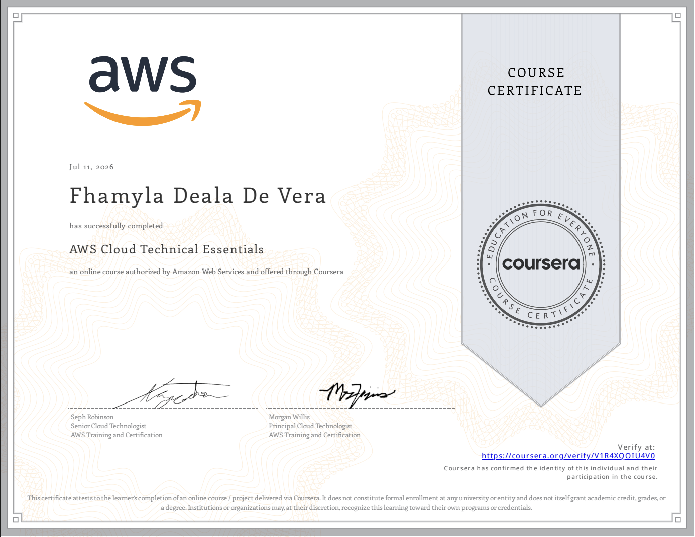
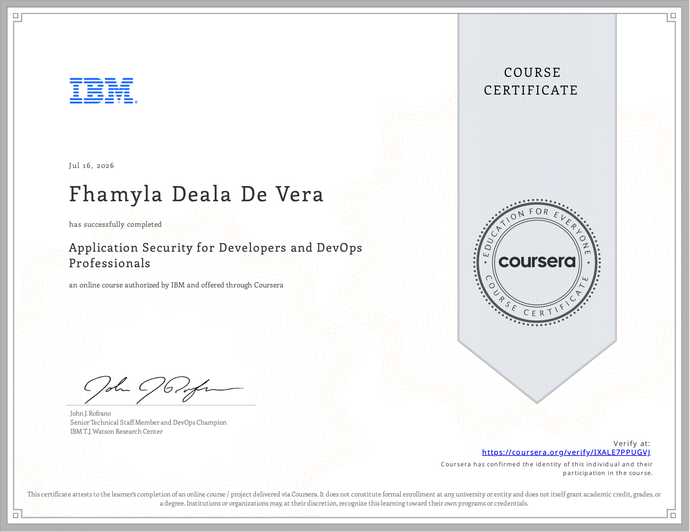

# 👋 Hi there, I'm Fhamyla!

  

Welcome to my GitHub! I'm a passionate developer focused on learning and building exciting things in tech.

## 👩‍💻 About Me

- 🌐 Interested in **cybersecurity**, **AI/ML**, **cloud**, and **full-stack development**
- 🛡️ ISC2 **Certified in Cybersecurity (CC)**
- 🧩 When I’m not working on tech, you’ll probably find me rewatching **My Neighbor Totoro** 💕

  

> My dream neighbor? Definitely Totoro.🌱

<h2 align="center">🏆 Certifications & Skill Badges</h2>

  <!-- ISC2 -->
  

  <!-- Cisco -->
  
  
  

  <!-- Coursera Certificate 1 -->
  

  <!-- Coursera Certificate 2 -->
  

  <!-- Google Skill Badge 1 -->
  

  <!-- Google Skill Badge 2 -->
  

  <!-- Google Skill Badge 3 -->
  

  <!-- Google Skill Badge 4 -->
  

  <!-- Google Skill Badge 5 -->
  

  <!-- Google Skill Badge 6 -->
  
  
  <!-- Google Skill Badge 8 -->
  
  
  <!-- Google Skill Badge 7 -->
  

  

  

  

  

  

## 🛠️ Technologies & Tools

  
  
  
  
  
  
  
  
  
  
  
  
  
  
  
  
  
  
  
  
  
  
  
  
  
  
  
  
  
  
  
  
  
  
  
  
  
  
  
  
  
  
  
  
  
  
  
  
  
  
  
  
  
  
  

---

Thanks for visiting my profile! Let's build something cool together 🚀

<!---
fhamyla/fhamyla is a ✨ special ✨ repository because its `README.md` (this file) appears on your GitHub profile.
You can click the Preview link to take a look at your changes.
--->
